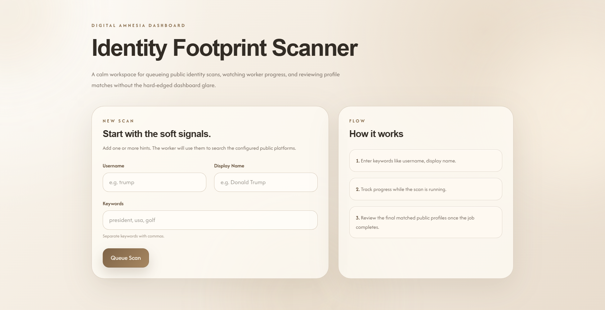

# Digital Amnesia Dashboard

Digital Amnesia Dashboard scans public social platforms for profiles matching a user's digital identity signals, helping users understand and track their online footprint.

## Demo

https://frontend-production-2b06.up.railway.app/



## Stack

- `frontend/`: React + Vite + Tailwind
- `backend/`: ASP.NET Core minimal API
- `worker/`: .NET background worker service
- storage: JSON

## Project Layout

```text
|- backend/
|- frontend/
|- scripts/
|- worker/
|- digital-amnesia-dashboard.sln
`- package.json
```

## How It Works

A real queue pipeline and mixed scan providers:

- the frontend creates a scan job
- the backend stores the job in a queue
- the worker claims queued jobs and updates progress
- GitHub uses a live public scan path through the GitHub REST API
- X can use a live public scan path through the X API when `X_BEARER_TOKEN` is configured
- Reddit remains mocked

## Requirements

- Node.js 22+
- npm 10+
- .NET 10 SDK

## Worker Configuration

Important worker environment variables:

- `BACKEND_API_URL`
- `GITHUB_SCANNER_MODE=live|mock`
- `X_SCANNER_MODE=auto|live|mock`
- `X_BEARER_TOKEN`

`X_SCANNER_MODE=auto` uses the live X scanner only when `X_BEARER_TOKEN` is present. The local end-to-end smoke test forces both GitHub and X to mock mode so it stays deterministic.

## Current Status

### Implemented

- Frontend scanning UI (form, progress, results)
- Job creation API
- Worker-based job processing with platform-by-platform progress tracking
- Live GitHub scanning
- Live-capable X scanning with token-based auth

### TODO

- Real Reddit scanning
- Improved matching algorithm
- Detailed post scanning

## API Summary

Public routes:

- `GET /health`
- `POST /api/jobs`
- `GET /api/jobs/{jobId}`

Internal worker routes:

- `POST /internal/jobs/claim`
- `PATCH /internal/jobs/{jobId}`

## Privacy & Ethics

This project:

- only accesses publicly available data
- does not bypass login systems or protections

## Limitations

- GitHub uses a live external scanner
- X uses a live scanner when `X_BEARER_TOKEN` is configured, otherwise it falls back to mock mode
- Reddit is still mocked
- backend persistence is a local JSON file
- the backend should not be horizontally scaled in this form
- internal worker endpoints are unauthenticated for demo purposes
